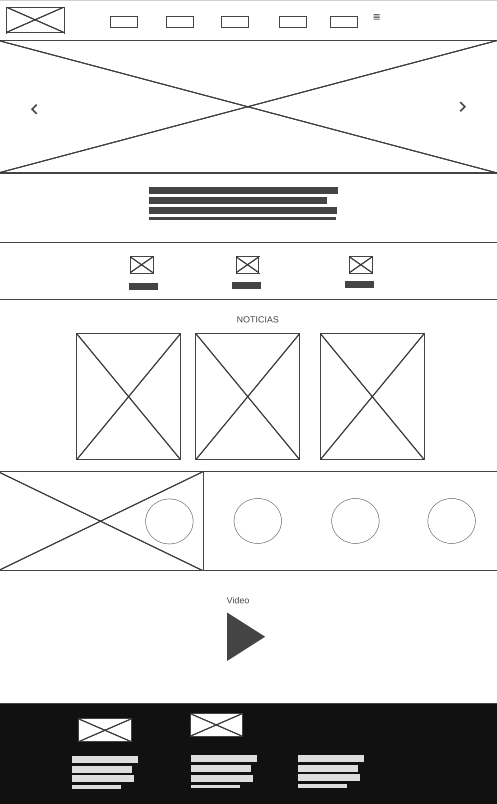
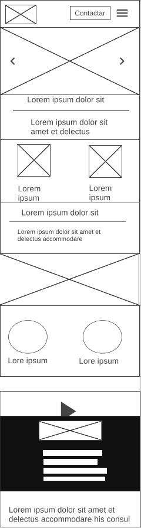

# Practica 2.

## Wireframe PC

En el wireframe de pc, podemos observar en la parte superior, más concretamente en la cabecera se puede apreciar lo siguiente: el logo de la entidad en la parte izquierda y el menú el cual tiene los enlaces a otras páginas y un submenú desplegable el cual este definido por el símbolo del menú hamburguesa.

En la parte inferior a la cabecera encontramos el body/cuerpo tenemos los siguientes elementos: podemos ver un slider que ocupa el ancho de toda la pantalla, debajo tenemos una serie de elementos con texto el cual podrían llevar a otra página, acto seguido tenemos dos parrilla representando diferente elementos, un video y el pie.

## Wireframe Movil

En el diseño del wireframe de móvil podemos ver que en la cabecera a diferencia del de pc no tenemos un menú hamburgués. Tenemos las dos mismas parrillas que teníamos en pc simplemente que los elementos se colocan uno debajo de otros.
Todo lo demás esta recalado para que se vea correcto en el móvil.

